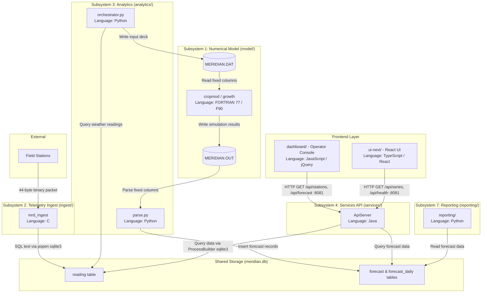

# Part 1: System Map (Whole System)

## Subsystem Overview

The Meridian codebase is split across seven subsystems and five programming languages (FORTRAN, C, Python, Java, and JavaScript/TypeScript). Each subsystem has a specific role and interface:

| Subsystem | Directory | Language | Responsibility | Exposed Interface |
|---|---|---|---|---|
| **Numerical Model** | `model/` | FORTRAN 77 / F90 | Computes daily soil moisture, crop canopy growth, and final grain yield. | Reads `MERIDIAN.DAT` and writes `MERIDIAN.OUT` in the current working directory. |
| **Telemetry Ingest** | `ingest/` | C | Parses 44-byte binary station frames, validates CRC-16 checksums, and saves readings. | Binary frame stream on stdin or spool file (`packet.h`); writes to SQLite `reading` table. |
| **Analytics & Orchestration** | `analytics/` | Python | Runs the nightly batch by extracting readings, building model decks, executing `cropmod`, and saving forecasts. | CLI script `run_forecast.py`; writes to SQLite `forecast` and `forecast_daily` tables. |
| **Services / API** | `services/` | Java | Serves station data, weather series, and forecast summaries to the web frontends. | REST HTTP API on port 8081 (`/api/forecast`, `/api/series`, `/api/stations`, `/api/health`). |
| **Operator Console** | `dashboard/` | JavaScript (jQuery) | Legacy operator dashboard showing station tables and a DOM-based bar chart without a build step. | Static web assets served on port 8080 (makes HTTP calls to port 8081). |
| **ui-next** | `ui-next/` | TypeScript / React | Work-in-progress React replacement for the console (3 of 11 screens implemented, 8 stubs). | Single-page web application served on port 5173 (makes HTTP calls to port 8081). |
| **Reporting & Export** | `reporting/` | Python | Produces fixed-format 132-column text reports and seasonal summaries for agronomists. | CLI suite (`python -m reporting`); reads SQLite forecast tables and prints text reports. |

---

## Architecture Component Diagram

The diagram below shows the seven subsystems, their implementation languages, and how data and control pass between them:

### Data and Control Flow Summary

1. **Ingest:** Field stations transmit 44-byte binary frames to `ingest/`. The C collector validates the packet CRC-16 and pipes SQL `INSERT` commands into the local SQLite database (`meridian.db`).
2. **Nightly Batch:** The Python orchestrator (`analytics/orchestrator.py`) queries the `reading` table, prepares a fixed-width input deck named `MERIDIAN.DAT`, and calls the Fortran binary (`model/cropmod`).
3. **Model Execution:** `cropmod` runs `waterbal.f` and `growth.f90`, then writes the output to `MERIDIAN.OUT`. The Python parser reads `MERIDIAN.OUT` by column position (handling column overflows per ticket MRD-143) and stores the results in the `forecast` and `forecast_daily` tables.
4. **API and Display:** The Java HTTP server (`services/ApiServer.java`) reads SQLite rows and serves JSON responses on port 8081. Both frontends (`dashboard/` and `ui-next/`) fetch data from this API. The Python reporting tool (`reporting/`) reads SQLite directly to output text bulletins.

---

## Where Does the README Lie?

The top-level `README.md` was written in November 2015 (commit `66a45e3`) and has not been kept up to date with the actual codebase. A new maintainer relying on it would be misled in several critical ways:

### 1. The Database Architecture Lie
* **README Claim (Line 19):**  
  *"The reading store is a PostgreSQL instance on `db01.meridian.internal`."*
* **What the Code Actually Does:**  
  There is no PostgreSQL instance or client library in the repository. The system uses a local, flat-file **SQLite** database (`meridian.db`). Furthermore, neither the C ingest tool nor the Java service link to a database driver:
  * In `ingest/src/tsstore.c` (lines 27–28), the collector calls `popen("sqlite3 ...")` to run SQL statements.
  * In `services/src/ca/meridian/db/Db.java` (lines 13–18 and 30), the author notes they could not install a JDBC driver and instead uses `ProcessBuilder("sqlite3", "-json", ...)` to shell out to the CLI.

### 2. The Application Architecture Lie
* **README Claim (Lines 11–17):**  
  Meridian is described as a *"three-tier application"* consisting of only the Collector (`ingest/`), Application server (`services/`), and Web client (`dashboard/`).
* **What the Code Actually Does:**  
  Meridian actually contains **seven distinct subsystems across five languages**. The README completely ignores:
  * `model/`: The core numerical crop and water balance model written in FORTRAN 77 and Fortran 90.
  * `analytics/`: The Python batch driver that builds model input decks and parses outputs.
  * `reporting/`: The Python CLI tool that generates fixed-format agronomist reports.
  * `ui-next/`: The partial React 18 rewrite of the operator dashboard.

### 3. The Batch Scheduling and Framework Lie
* **README Claim (Lines 15–16 & 27–30):**  
  The application server is described as a *"Spring Boot application"* and the nightly batch is *"scheduled by the application server's Quartz configuration. See `services/src/main/resources/quartz.properties`."*
* **What the Code Actually Does:**  
  Spring Boot and Quartz were completely removed in February 2017 (commit `e3acae7`). The directory `services/src/main/resources/quartz.properties` does not exist. The Java service now runs as a bare JDK `HttpServer` (`services/src/ca/meridian/api/ApiServer.java`), and the nightly forecast batch is executed independently by a Python script (`analytics/run_forecast.py`) via Linux cron.
