# Part 1: System Map & README Audit (Whole System)

**Team:** Canopy  
**Subsystem Focus:** Numerical Model (`model/` — Crop-growth / `cropmod`)  
**Deliverable:** Recovered System Architecture, UML Component Model, and Documentation Audit  

---

## 1. Executive Summary: Recovered Real Architecture

Meridian is not a conventional 3-tier web application as claimed in its legacy documentation. Through code reconnaissance and git archaeology, the actual system is revealed to be a **seven-subsystem, polyglot agri-environmental monitoring and yield-forecasting pipeline** spanning three decades of engineering (1994–2026) across five programming languages (FORTRAN 77/90, C99, Python 3, Java, and TypeScript/JavaScript).

Rather than communicating through modern enterprise message buses or an ORM-backed relational database cluster, Meridian operates as a **hybrid batch pipeline centred around an embedded SQLite flat-file store and fixed-format file I/O**:
1. Field telemetry is ingested via a native **C** daemon (`ingest/`).
2. An embedded **SQLite** database (`data/meridian.db`) serves as the universal decoupled message bus.
3. A **Python** analytics engine (`analytics/`) extracts raw observations and constructs rigid, 80-column punchcard-era input decks (`MERIDIAN.DAT`).
4. A legacy **FORTRAN 77 / Fortran 90** agronomic simulation engine (`model/cropmod`) runs synchronously in the current working directory, writing fixed-width output (`MERIDIAN.OUT`).
5. The Python analytics layer slices the model output column-by-column to populate forecast tables.
6. A stripped-down **Java** HTTP server (`services/`) shells out to the `sqlite3` CLI tool to serve JSON REST endpoints.
7. **Two separate frontends** co-exist in production: a legacy jQuery console (`dashboard/`) and a stalled 2023 React SPA rewrite (`ui-next/`).
8. A standalone **Python** reporting package (`reporting/`) outputs 132-column text bulletins directly for field agronomists.

---

## 2. Subsystem Decomposition Table

The table below describes the seven real subsystems recovered from the source tree:

| # | Subsystem & Path | Implementation Language | One-Line Responsibility | Exposed Interface & Protocol |
|---|---|---|---|---|
| **1** | **Numerical Model**<br>`model/` | FORTRAN 77 & Fortran 90 | Simulates soil-water balance, daily crop canopy development, and grain yield accumulation. | **File I/O Interface:** Reads column-exact 80-column `MERIDIAN.DAT` on Unit 10; writes column-exact `MERIDIAN.OUT` on Unit 20 in CWD. |
| **2** | **Telemetry Ingest**<br>`ingest/` | C (C99 standard) | Decodes binary field-station packets, validates CRC-16 checksums and quality flags, and spools readings. | **Binary Stream Interface:** Consumes 44-byte big-endian frames (`packet.h`) via stdin or spool files; outputs SQL via `popen("sqlite3 ...")`. |
| **3** | **Analytics & Orchestration**<br>`analytics/` | Python 3 | Orchestrates nightly forecast runs: queries readings, formats Fortran decks, executes `cropmod`, parses output, and persists forecasts. | **CLI / Python Module Interface:** Invoked via `run_forecast.py` / `orchestrator.py`; reads `reading` table; populates `forecast` and `forecast_daily` SQLite tables. |
| **4** | **Services / API**<br>`services/` | Java (bare JDK `HttpServer`) | Exposes weather series, station registries, and yield forecasts over HTTP for client applications. | **HTTP/JSON REST API:** Serves endpoints on port `8081` (`/api/health`, `/api/stations`, `/api/forecast`, `/api/series`, `/api/anomalies`, `/api/summary`) with CORS enabled. |
| **5** | **Operator Console**<br>`dashboard/` | JavaScript (jQuery 1.11), HTML5, CSS | Provides a zero-build legacy web dashboard with tabular station monitors and a hand-rolled DOM bar chart. | **HTTP Web UI:** Served on port `8080` (static HTML/CSS/JS assets); consumes REST API on port `8081`. |
| **6** | **ui-next**<br>`ui-next/` | TypeScript, React 18, Vite | Stalled 2023 modern single-page console rewrite (3 of 11 screens active: Stations, Forecast, Health; 8 screens stubbed). | **Modern Web SPA:** Served via Vite dev server (`:5173`) or static bundle; consumes REST API on port `8081`. |
| **7** | **Reporting & Export**<br>`reporting/` | Python 3 | Generates fixed-format 132-column text reports and seasonal yield summaries for provincial agronomists. | **CLI Suite Interface:** Invoked via `python -m reporting ...`; reads SQLite forecast tables; emits fixed-format text bulletins to stdout or files. |

---

## 3. Architecture Component Diagram

The UML Component Diagram below illustrates all seven subsystems, their languages, persistent data boundaries, and control/data vectors.

```mermaid
flowchart TB
    %% ========================================================
    %% MERIDIAN ARCHAEOLOGY - A2 SYSTEM MAP COMPONENT DIAGRAM
    %% Team Canopy: Whole-System Architecture
    %% ========================================================

    subgraph EXTERNAL["External Field Network"]
        FS["Field Stations (Automated Agri-Sensors)<br><i>Channels: TMAX, TMIN, RAIN, SRAD, RH, WIND</i>"]
    end

    subgraph SUBSYSTEM_INGEST["Subsystem 2: Telemetry Ingest (ingest/)"]
        direction TB
        ING_COMP["&laquo;component&raquo;<br><b>mrd_ingest / tsstore</b><br>Language: C (C99)<br>CRC16 Validation &amp; Spooling"]
        ING_IF["&laquo;interface&raquo;<br>Binary Frame Stream (:stdin / file spool)<br>44-byte Big-Endian (packet.h)"]
        ING_IF --> ING_COMP
    end

    subgraph STORAGE["Shared Data Store (data/meridian.db)"]
        direction TB
        DB_READING[("reading Table<br><i>stnid, year, doy, tmax, tmin, rain, srad, rh, wind, flags</i>")]
        DB_FORECAST[("forecast Table<br><i>stnid, year, run_at, yield_t, ndays, model</i>")]
        DB_DAILY[("forecast_daily Table<br><i>stnid, year, doy, sw, et, drain, biom, lai</i>")]
    end

    subgraph SUBSYSTEM_ANALYTICS["Subsystem 3: Analytics &amp; Orchestration (analytics/)"]
        direction TB
        ORCH_COMP["&laquo;component&raquo;<br><b>Orchestrator &amp; DeckBuilder</b><br>Language: Python 3<br>Nightly Batch Driver"]
        PARSE_COMP["&laquo;component&raquo;<br><b>Output Parser &amp; Results DTO</b><br>Language: Python 3<br>Column-slice reader (MRD-143)"]
        ORCH_CLI["&laquo;interface&raquo;<br>CLI Entry Point: run_forecast.py"]
        ORCH_CLI --> ORCH_COMP
    end

    subgraph SUBSYSTEM_MODEL["Subsystem 1: Numerical Model (model/) &mdash; Canopy Focus"]
        direction TB
        MODEL_DRIVER["&laquo;component&raquo;<br><b>CROPMOD Driver (cropmod.f)</b><br>Language: FORTRAN 77<br>Fixed I/O &amp; Ascending DOY assumption"]
        MODEL_GROWTH["&laquo;component&raquo;<br><b>GROWTH Model (growth.f90)</b><br>Modules: phenology, canopy, partition<br>Language: Fortran 90"]
        MODEL_WATBAL["&laquo;component&raquo;<br><b>WATBAL Engine (waterbal.f)</b><br>Multi-layer soil water &amp; runoff<br>Language: Fortran 77"]
        
        MODEL_DRIVER --> MODEL_GROWTH
        MODEL_DRIVER --> MODEL_WATBAL
        
        IN_DECK["&laquo;interface / file&raquo;<br>MERIDIAN.DAT<br>80-column fixed-width input deck"]
        OUT_FILE["&laquo;interface / file&raquo;<br>MERIDIAN.OUT<br>Fixed-width tabular simulation output"]
        
        IN_DECK --> MODEL_DRIVER
        MODEL_DRIVER --> OUT_FILE
    end

    subgraph SUBSYSTEM_SERVICES["Subsystem 4: Services / API (services/)"]
        direction TB
        API_COMP["&laquo;component&raquo;<br><b>ApiServer (Bare JDK HttpServer)</b><br>Language: Java<br>QueryBuilder via sqlite3 CLI popen"]
        API_IF["&laquo;interface&raquo;<br>REST HTTP API (:8081)<br>JSON / CORS enabled"]
        API_COMP --> API_IF
    end

    subgraph CLIENTS["Presentation Layer (Dual Consoles)"]
        subgraph SUBSYSTEM_DASHBOARD["Subsystem 5: Operator Console (dashboard/)"]
            DASH_COMP["&laquo;component&raquo;<br><b>Operator Console</b><br>Language: JS (jQuery 1.11)<br>Static HTML5/DOM bar chart (no build)"]
        end

        subgraph SUBSYSTEM_UINEXT["Subsystem 6: Modern UI (ui-next/)"]
            UINEXT_COMP["&laquo;component&raquo;<br><b>ui-next SPA (Stalled Rewrite)</b><br>Language: TypeScript / React 18 (Vite)<br>3 of 11 screens active, 8 stubs"]
        end
    end

    subgraph SUBSYSTEM_REPORTING["Subsystem 7: Reporting &amp; Export (reporting/)"]
        direction TB
        REP_COMP["&laquo;component&raquo;<br><b>Report Writer</b><br>Language: Python 3<br>Replaces legacy COBOL RPTGEN"]
        REP_OUT["&laquo;interface / artifact&raquo;<br>132-Column Fixed-Format Text<br>Season summaries &amp; station bulletins"]
        REP_COMP --> REP_OUT
    end

    %% Data and Control Flow Interconnections
    FS -->|"Raw Telemetry Packets (RS-485 / Radio)"| ING_IF
    ING_COMP -->|"SQL INSERT statements via popen('sqlite3 ...')"| DB_READING

    ORCH_COMP -->|"SQL SELECT readings (SQLite library)"| DB_READING
    ORCH_COMP -->|"Writes CWD fixed file (docs/DECKFMT.txt)"| IN_DECK
    OUT_FILE -->|"Reads column-by-column (docs/OUTFMT.txt)"| PARSE_COMP
    PARSE_COMP -->|"SQL INSERT / UPDATE forecasts"| DB_FORECAST
    PARSE_COMP -->|"SQL INSERT daily time series"| DB_DAILY

    API_COMP -->|"Spawns ProcessBuilder('sqlite3', '-json', ...)"| DB_READING
    API_COMP -->|"Queries station &amp; forecast state"| DB_FORECAST
    API_COMP -->|"Queries daily series"| DB_DAILY

    DASH_COMP -->|"HTTP GET /api/stations, /api/forecast (:8081)"| API_IF
    UINEXT_COMP -->|"HTTP GET /api/series, /api/health (:8081)"| API_IF

    REP_COMP -->|"Reads forecast &amp; reading tables directly"| STORAGE

    %% Styling
    classDef comp fill:#f0f4f8,stroke:#334e68,stroke-width:2px,color:#102a43;
    classDef iface fill:#e0f2fe,stroke:#0284c7,stroke-width:1.5px,stroke-dasharray: 4 2,color:#0369a1;
    classDef store fill:#fef3c7,stroke:#d97706,stroke-width:2px,color:#78350f;
    classDef ext fill:#fee2e2,stroke:#dc2626,stroke-width:1.5px,color:#7f1d1d;

    class ING_COMP,ORCH_COMP,PARSE_COMP,MODEL_DRIVER,MODEL_GROWTH,MODEL_WATBAL,API_COMP,DASH_COMP,UINEXT_COMP,REP_COMP comp;
    class ING_IF,IN_DECK,OUT_FILE,API_IF,REP_OUT,ORCH_CLI iface;
    class DB_READING,DB_FORECAST,DB_DAILY store;
    class FS ext;
```



---

## 4. Where Does the README Lie? (Documentation vs. Reality Audit)

The repository's top-level [README.md](file:///Users/unsurhussain/Meridian-Archaeology-Canopy/README.md) was originally committed on **2015-11-04** (commit `66a45e3` by D. Ferreira) and has not been updated to reflect the substantial architectural migrations of the past decade. It paints a picture of an orthodox Java EE / Spring application backed by PostgreSQL. In reality, trusting this README would completely derail a new maintainer.

Below are **four concrete falsehoods** in the project's documentation, cross-referenced with exact code citations and git history:

### Lie 1: The Database Architecture (PostgreSQL vs. Embedded SQLite)
* **README Claim (Line 19):**
  > *"The reading store is a PostgreSQL instance on `db01.meridian.internal`."*
* **What the Code Actually Does:**
  There is **no PostgreSQL database anywhere in Meridian**. There is no JDBC driver, no connection pool, and no TCP connection string to any database server. The true reading and forecast store is a local, embedded **SQLite flat file** (`data/meridian.db`). 
* **Concrete Proof in Code:**
  1. **Ingest Subsystem:** In [ingest/src/tsstore.c:L27-28](file:///Users/unsurhussain/Meridian-Archaeology-Canopy/ingest/src/tsstore.c#L27-L28), the C collector establishes its storage pipeline by executing:
     ```c
     snprintf(cmd, sizeof(cmd), "sqlite3 %s", g_path);
     g_pipe = popen(cmd, "w");
     ```
     It literally pipes raw SQL text directly into the command-line `sqlite3` process!
  2. **Services Subsystem:** In [services/src/ca/meridian/db/Db.java:L13-32](file:///Users/unsurhussain/Meridian-Archaeology-Canopy/services/src/ca/meridian/db/Db.java#L13-L32), the author A. Okonkwo explicitly writes:
     > *"The collector host never had the SQLite JDBC driver installed and the deployment process for adding one was never agreed, so this class shells out to the sqlite3 command line and reads its JSON output. It was meant to be temporary. See MRD-77."*
     The query execution uses:
     ```java
     ProcessBuilder pb = new ProcessBuilder("sqlite3", "-json", dbPath, sql);
     ```
  3. **Analytics Subsystem:** In [analytics/meridian/store.py:L26-30](file:///Users/unsurhussain/Meridian-Archaeology-Canopy/analytics/meridian/store.py#L26-L30), Python uses standard `sqlite3.connect(self.db_path)`.
* **Hazard:** A maintainer attempting to provision a PostgreSQL server or connect via port 5432 will find zero code that connects to it.

---

### Lie 2: Subsystem Scope (Three-Tier App vs. Seven Subsystems)
* **README Claim (Lines 11–17):**
  > *"Meridian is a three-tier application: 1. Collector (`ingest/`), 2. Application server (`services/`), 3. Web client (`dashboard/`)."*
* **What the Code Actually Does:**
  The README omits **more than half of the codebase**! Meridian is a seven-subsystem distributed data processing pipeline. Most critically, the README fails to mention:
  * `model/`: The entire 30-year-old core agronomy simulation engine written in FORTRAN 77 and Fortran 90 ([cropmod.f](file:///Users/unsurhussain/Meridian-Archaeology-Canopy/model/cropmod.f), [growth.f90](file:///Users/unsurhussain/Meridian-Archaeology-Canopy/model/growth.f90)).
  * `analytics/`: The Python batch orchestrator that runs nightly forecasts, parses output, and aggregates stats.
  * `reporting/`: The Python reporting suite that generates 132-column text bulletins.
  * `ui-next/`: The active, stalled React 18 / TypeScript SPA rewrite. Both consoles currently ship simultaneously!
* **Hazard:** A developer reading the README would not even know that Fortran compilers (`gfortran`) or Python environments are required to execute the core business value of Meridian (crop yield forecasting).

---

### Lie 3: Batch Scheduling & Server Framework (Spring Boot Quartz vs. Bare JDK & Python Cron)
* **README Claim (Lines 15–16 & 27–30):**
  > *"Application server (`services/`) is a Spring Boot application exposing the REST API and the scheduled batch jobs... The batch is scheduled by the application server's Quartz configuration. See `services/src/main/resources/quartz.properties`."*
* **What the Code Actually Does:**
  * The file `services/src/main/resources/quartz.properties` **does not exist**.
  * Spring Boot was completely decommissioned in February 2017 (commit `e3acae7` by M. Brandt: *"Reduce service layer to the JDK HTTP server; add DTOs"*).
  * In [services/src/ca/meridian/api/ApiServer.java:L17-21](file:///Users/unsurhussain/Meridian-Archaeology-Canopy/services/src/ca/meridian/api/ApiServer.java#L17-L21), the code documents:
    > *"Started as a Spring application in 2014 and reduced to the JDK HTTP server in 2017 when the container host was retired. The package layout still reflects the Spring structure."*
    The server uses `com.sun.net.httpserver.HttpServer`.
  * The Java application server schedules **nothing**. The nightly batch is driven by a standalone Python CLI script invoked by host `cron`: [analytics/run_forecast.py:L2](file:///Users/unsurhussain/Meridian-Archaeology-Canopy/analytics/run_forecast.py#L2):
    > *"Nightly forecast entry point. Invoked from cron on the app host."*
* **Hazard:** Looking for Spring annotations, `@Scheduled` tasks, or Quartz jobs will lead nowhere; changes made expecting Spring dependency injection will fail to compile.

---

### Lie 4: Build System & Dependencies (`./gradlew build` vs. Makefiles & Shell Scripts)
* **README Claim (Lines 21–25):**
  > *"Building: `./gradlew build`. Requires JDK 8 and PostgreSQL 9.4 client libraries."*
* **What the Code Actually Does:**
  * There is no Gradle wrapper (`./gradlew`), no `build.gradle`, no Gradle cache, and no PostgreSQL client libraries (`libpq-dev`).
  * The top-level build is governed by a unified [Makefile](file:///Users/unsurhussain/Meridian-Archaeology-Canopy/Makefile), which orchestrates sub-builds:
    * `make -C model` invokes `gfortran` to compile the Fortran numerical engine.
    * `make -C ingest` invokes `gcc` to compile the C telemetry collector.
    * `./services/build.sh` invokes raw `javac` to build the Java classes into `services/build/classes`.
    * `dashboard` has no build step (see ticket **MRD-181**).
    * `ui-next` requires `npm install` and `npm run build` (Vite).
* **Hazard:** Automated CI/CD pipelines configured based on the README's `./gradlew build` directive will immediately fail with a missing executable error.

---

## 5. Summary of Architectural Hazards (Bridge to A3)

Trusting stale documentation in long-lived production systems (like Meridian) is hazardous because architectural changes are often made under operational duress without updating the docs:
1. **The Temporary Hack Fallacy (MRD-77):** Shelling out to `sqlite3` was written as a "temporary" measure in 2012 and 2014 because deploying native SQLite drivers proved difficult. It has now been active across multiple subsystems for over a decade.
2. **Hidden Batch Dependencies (MRD-201):** The numerical model (`cropmod`) reads and writes fixed filenames (`MERIDIAN.DAT`, `MERIDIAN.OUT`) in its current working directory. Because the README hid the existence of `model/` and `analytics/`, maintainers were unaware of why the nightly batch could not be scaled horizontally or parallelised across multiple CPU cores.

---

## 6. Agent Appendix Contribution (Part 1 Audit)

As required by Section 7 of the assignment specification, below is an honest record of AI agent interactions, claims verified against the codebase, and errors caught during the Part 1 investigation:

1. **AI Claim on Subsystem Filepaths:**
   * *Claim:* The AI agent originally assumed that `tsstore.c` was located directly at `ingest/tsstore.c`.
   * *Verification:* Running file system inspection revealed `tsstore.c` was actually located in a nested `ingest/src/` directory (`ingest/src/tsstore.c`).
   * *Impact:* Correct filepaths were established in the citations and component diagrams.

2. **AI Claim on Numerical Model Implementation Language:**
   * *Claim:* The AI agent initially generalized the numerical model as simply "Fortran 90".
   * *Verification:* Inspected `model/cropmod.f` and observed fixed-column format, `C` comment indicators, and column-6 continuation lines standard in **FORTRAN 77**, whereas subroutines like `growth.f90`, `canopy.f90`, and `phenology.f90` utilize modern **Fortran 90** free-form syntax and modules.
   * *Correction:* Updated the architectural map and subsystem decomposition to accurately designate the subsystem as a hybrid **FORTRAN 77 + Fortran 90** codebase.

3. **Verification of the "Spring Boot Quartz" Claim:**
   * *AI Suggestion:* The agent flagged that `services/src/main/resources/quartz.properties` mentioned in the README might be stale.
   * *Verification:* Ran `grep` and file listing across `services/`. Confirmed that no `resources/` folder or `quartz.properties` exists, and discovered commit `e3acae7` ("Reduce service layer to the JDK HTTP server"), validating that Spring Boot and Quartz were completely removed from the project in 2017.

