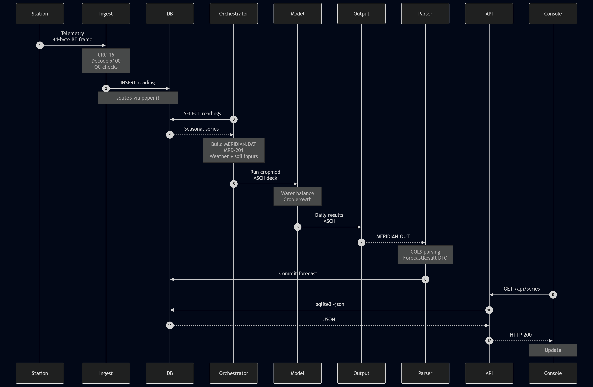

# Part 2: End-to-End Trace (Whole System)

This document traces the complete lifecycle of a single weather reading in the Meridian platform—from its generation at a remote field station to its ultimate rendering as an agronomic indicator on the operator console:

$$\text{frame} \longrightarrow \text{ingest} \longrightarrow \text{store} \longrightarrow \text{orchestrator} \longrightarrow \text{model} \longrightarrow \text{output} \longrightarrow \text{parser} \longrightarrow \text{store} \longrightarrow \text{API} \longrightarrow \text{console}$$

The trace spans five programming languages (**C**, **Python**, **FORTRAN 77/90**, **Java**, and **JavaScript**), traversing three decades of legacy interfaces and architectural boundaries.

---

## 2. Sequence Diagram

The visual sequence diagram is provided below and committed to the repository as both an editable Mermaid source file (`docs/part2_reading_trace.mmd`) and a rendered graphic (`docs/part2_reading_trace.png`).




## 3. Detailed Step-by-Step Hand-Offs & Data Formats

### Step 1: Field Station $\rightarrow$ Telemetry Ingest (`ingest/`)
- **Sender / Receiver**: Field Logger Station $\rightarrow$ `mrd_ingest` (`ingest/src/packet.h`, `ingest/src/packet.c`, `ingest/src/mrd_ingest.c`)
- **Data Format**: **44-byte binary frame** (big-endian / network byte order)
- **Protocol & Layout**:
  - `0x00..0x03` (4 B): Magic identifier `MRD1` (`0x4D524431`).
  - `0x04..0x0B` (8 B): Station identifier string (ASCII, space-padded, e.g., `"GUELPH  "`).
  - `0x0C..0x0D` (2 B): Calendar year (uint16_t).
  - `0x0E..0x0F` (2 B): Day of Year (`doy`, 1–366, uint16_t).
  - `0x10..0x27` (24 B): Six fixed positional channels of 32-bit signed integers (scaled by 100):
    1. Maximum temperature (`tmax` in $^\circ\text{C} \times 100$)
    2. Minimum temperature (`tmin` in $^\circ\text{C} \times 100$)
    3. Precipitation (`rain` in $\text{mm} \times 100$)
    4. Solar radiation (`srad` in $\text{MJ/m}^2/\text{day} \times 100$)
    5. Relative humidity (`rh` in $\% \times 100$)
    6. Wind speed (`wind` in $\text{m/s} \times 100$)
  - `0x28..0x29` (2 B): Quality flags (e.g., `MRD_FLAG_SUSPECT`, `MRD_FLAG_MANUAL`).
  - `0x2A..0x2B` (2 B): CRC-16 checksum (`mrd_crc16`, CCITT polynomial).
- **Processing**: `mrd_packet_parse()` validates magic bytes and CRC-16 over the first 42 bytes, unpacks big-endian words into host representation, and scales integer values into physical floating-point units via `mrd_scale()` (`raw / 100.0`).

### Step 2: Telemetry Ingest $\rightarrow$ Database Store (`meridian.db`)
- **Sender / Receiver**: `mrd_ingest` (`ingest/src/tsstore.c`) $\rightarrow$ SQLite database file (`meridian.db`)
- **Data Format**: **SQL text piped via `popen`** (`sqlite3 data/meridian.db`)
- **Details**:
  - `mrd_store_append()` formats a direct SQL text string:
    ```sql
    INSERT OR REPLACE INTO reading
      (stnid, year, doy, tmax, tmin, rain, srad, rh, wind, flags)
      VALUES ('GUELPH', 2025, 180, 26.50, 14.20, 0.00, 22.40, 68.00, 3.10, 0);
    ```
  - Commits in bulk within a single transaction (`BEGIN` ... `COMMIT`) upon stream closure (`mrd_store_close`).
  - *Archaeology Note*: This pipe-to-CLI approach was introduced in 2012 as a temporary migration measure (MRD-77) and remains in production.

### Step 3: Database Store $\rightarrow$ Analytics Orchestrator (`analytics/`)
- **Sender / Receiver**: SQLite database file $\rightarrow$ `orchestrator.py` via `analytics/meridian/store.py`
- **Data Format**: **Relational SQLite rows $\rightarrow$ Python `Reading` named tuples**
- **Details**:
  - The orchestrator (`Store.readings()`) fetches seasonal observations ordered chronologically:
    ```sql
    SELECT stnid, year, doy, tmax, tmin, rain, srad 
    FROM reading 
    WHERE stnid = ? AND year = ? 
    ORDER BY doy
    ```
  - Instantiates Python domain `Reading` objects containing `(stnid, year, doy, tmax, tmin, rain, srad)`.
  - *Channel Selection*: Note that while the ingest store retains 6 channels, the model only accepts 4 (`tmax`, `tmin`, `rain`, `srad`). The `rh` and `wind` channels are dropped at this interface.

### Step 4: Analytics Orchestrator $\rightarrow$ Numerical Model (`model/`)
- **Sender / Receiver**: `orchestrator.py` (`analytics/meridian/deck.py`) $\rightarrow$ `cropmod` executable (`model/cropmod.f`, `model/waterbal.f`, `model/growth.f90`)
- **Data Format**: **Fixed-width column-exact ASCII deck (`MERIDIAN.DAT`)**
- **Deck Structure**:
  - **Record 1** (`FORMAT(A8, I4, F8.3)`): Station ID (cols 1–8), calendar year (cols 9–12), latitude in decimal degrees north (cols 13–20).
  - **Record 2** (`FORMAT(F8.2, F8.2)`): Available water capacity (cols 1–8), rooting depth in mm (cols 9–16).
  - **Daily Records** (`FORMAT(I3, F6.1, F6.1, F6.1, F6.2)`): DOY (cols 1–3), $T_{\max}$ (cols 4–9), $T_{\min}$ (cols 10–15), rain (cols 16–21), solar radiation (cols 22–27).
  - **Terminator**: ` -1` (cols 1–3 negative sentinel).
- **Execution & Isolation Constraints**:
  - Soil parameters (`awc`, `rooting depth`) do not exist in the database; `deck.py` hardcodes them in a static lookup dictionary `SOIL` (ticket **MRD-91**).
  - Because `cropmod` hardcodes file names relative to the current working directory, `orchestrator.py` isolates execution in a temporary scratch directory created by `ScratchRun` and executes `cropmod` via subprocess under a run lock (**MRD-201**).

### Step 5: Numerical Model $\rightarrow$ Raw Output File (`MERIDIAN.OUT`)
- **Sender / Receiver**: `cropmod` Fortran binary $\rightarrow$ Scratch disk file (`MERIDIAN.OUT`)
- **Data Format**: **Fixed-width column-exact ASCII text (`MERIDIAN.OUT`)**
- **File Structure**:
  - **Line 1 (Banner)**: `MERIDIAN CROPMOD V2.3  STN=<id>  YEAR=<yyyy>  NDAYS=<n>` (`FORMAT 910`).
  - **Line 2 (Header)**: Fixed column label header (`FORMAT 911`).
  - **Lines 3 to $N+2$** (`FORMAT(I4, 1X, F7.2, 1X, F7.3, 1X, F7.3, 1X, F7.1, 1X, F7.3)`):
    - Cols 1–4: Day of year (`doy`)
    - Cols 6–12: Soil water (`sw`, mm)
    - Cols 14–20: Actual evapotranspiration (`et`, mm)
    - Cols 22–28: Drainage (`drain`, mm)
    - Cols 30–36: Above-ground biomass (`biom`, $\text{g/m}^2$)
    - Cols 38–44: Leaf area index (`lai`)
  - **Last Line**: `YIELD <F10.3>` (grain yield in t/ha, `FORMAT 913`).

### Step 6: Raw Output File $\rightarrow$ Output Parser (`parse.py`)
- **Sender / Receiver**: `MERIDIAN.OUT` on disk $\rightarrow$ `parse.py` (`analytics/meridian/parse.py`)
- **Data Format**: **Column character slice parsing $\rightarrow$ Python `ForecastResult` / `DailyRow` DTOs**
- **Nightshift $\rightarrow$ Archive Seam**:
  - `NightshiftRun` hands `RunArtifacts` across the seam to `_absorb()`.
  - `parse.py` reads `MERIDIAN.OUT` strictly by 0-based character spans:
    `COLS = [(0, 4), (5, 12), (13, 20), (21, 28), (29, 36), (37, 44)]`.
  - *Archaeology Note*: Whitespace splitting (`line.split()`) is strictly prohibited here. When simulated soil water exceeds 9999.99 mm, the DOY and SW fields run into one another without a space; splitting silently dropped days (**MRD-143**). Column slicing prevents this data loss.

### Step 7: Output Parser $\rightarrow$ Database Store (`meridian.db`)
- **Sender / Receiver**: `orchestrator.py` (`analytics/meridian/store.py`) $\rightarrow$ SQLite database
- **Data Format**: **Parameterized SQL transactions (`forecast` and `forecast_daily`)**
- **Details**:
  - `Store.save_forecast()` persists the summary metrics into `forecast`:
    ```sql
    INSERT OR REPLACE INTO forecast (stnid, year, run_at, yield_t, ndays, model)
    VALUES ('GUELPH', 2025, '2026-09-30T11:00:00', 9.845, 180, 'cropmod-1994');
    ```
  - Inserts daily simulated timeseries into `forecast_daily` using `executemany`:
    ```sql
    INSERT OR REPLACE INTO forecast_daily (stnid, year, doy, sw, et, drain, biom, lai)
    VALUES ('GUELPH', 2025, 180, 84.25, 3.120, 0.000, 1145.2, 3.450);
    ```

### Step 8: Database Store $\rightarrow$ Services API (`services/`)
- **Sender / Receiver**: SQLite database file $\rightarrow$ Java REST API (`services/src/ca/meridian/api/SeriesHandler.java`, `services/src/ca/meridian/db/Db.java`)
- **Data Format**: **`sqlite3 -json` CLI process output stream $\rightarrow$ HTTP JSON response**
- **Details**:
  - The operator console requests `GET /api/series?station=GUELPH&year=2025`.
  - *Archaeology Note (Where the README lies & No JDBC)*: While the README claims a PostgreSQL database and an enterprise Spring Boot app, the code in `Db.java` reveals that the production server never had an SQLite JDBC driver installed. Instead, `Db.queryJson()` executes a subprocess using `ProcessBuilder("sqlite3", "-json", dbPath, sql)` to query `forecast_daily`:
    ```sql
    SELECT doy, sw, et, drain, biom, lai 
    FROM forecast_daily 
    WHERE stnid = 'GUELPH' AND year = 2025 
    ORDER BY doy
    ```
  - The stdout JSON stream from `sqlite3` is read directly into memory and returned with `Content-Type: application/json` and CORS headers (`Access-Control-Allow-Origin: *`).

### Step 9: Services API $\rightarrow$ Operator Console (`dashboard/`)
- **Sender / Receiver**: Java API (`ApiServer`) $\rightarrow$ Legacy Browser Dashboard (`dashboard/js/dashboard.js`, `dashboard/js/api.js`)
- **Data Format**: **Parsed JSON array $\rightarrow$ DOM HTML table rows and CSS bar elements**
- **Details**:
  - `MeridianApi.series()` triggers an AJAX GET request and passes rows to `loadSeries()`.
  - Injects formatted text into table rows under `#series tbody`:
    ```html
    <tr><td>180</td><td>84.3</td><td>3.12</td><td>0.00</td><td>1145</td><td>3.45</td></tr>
    ```
  - Calls `drawChart(rows, maxb)` to dynamically compute proportional CSS bar heights (`(r.biom / maxb) * 150`) and inject `.bar` `div` nodes into `#chart` (stopgap charting implementation, **MRD-181**).
  - The weather reading that originated as a 44-byte binary frame at the field station is now visible to agronomists as a modeled crop biomass number and visual bar height.

---

## 4. Hand-off and Data Format Summary Matrix

| Step | Subsystem Transition | Source Artifact | Target Artifact | Data Format / Protocol | Key Invariants & Edge Cases |
| :--- | :--- | :--- | :--- | :--- | :--- |
| **1** | Station $\rightarrow$ Ingest | Logger telemetry | `mrd_ingest` (`packet.c`) | 44-byte binary frame (big-endian) | CRC-16 CCITT checksum, fixed scale factor $(\times 100)$, positional channel indices. |
| **2** | Ingest $\rightarrow$ Store | `tsstore.c` | `meridian.db` | SQL text via `popen("sqlite3")` | Primary key `(stnid, year, doy)`; temporary shell piping hack (MRD-77). |
| **3** | Store $\rightarrow$ Orchestrator | `store.py` | `orchestrator.py` | SQLite rows $\rightarrow$ Python `Reading` DTOs | Sorted ascending by `doy`; `rh` and `wind` dropped; soil constants hardcoded per station (MRD-91). |
| **4** | Orchestrator $\rightarrow$ Model | `deck.py` | `cropmod` executable | Column-exact ASCII `MERIDIAN.DAT` | Fixed FORMAT (900/901/902); run locked in serial scratch directory (MRD-201). |
| **5** | Model $\rightarrow$ Output File | `cropmod` Fortran core | `MERIDIAN.OUT` | Column-exact ASCII (FORMAT 910–913) | Fixed width; fields overflow into neighbors or print `*******` when out of range. |
| **6** | Output File $\rightarrow$ Parser | `MERIDIAN.OUT` | `parse.py` | Character slices $\rightarrow$ `ForecastResult` | Strict index slicing `COLS` avoids `split()` whitespace corruption (MRD-143). |
| **7** | Parser $\rightarrow$ Store | `parse.py` / `store.py` | `meridian.db` | Parameterized SQL (`forecast`, `forecast_daily`) | Single atomic transaction for summary row and daily points. |
| **8** | Store $\rightarrow$ Services API | `meridian.db` | `SeriesHandler.java` / `Db.java` | CLI stdout stream $\rightarrow$ `application/json` | No JDBC driver installed (MRD-77); shells out via `ProcessBuilder("sqlite3", "-json", ...)`. |
| **9** | Services API $\rightarrow$ Console | `ApiServer` | `dashboard.js` (`index.html`) | JSON payload $\rightarrow$ DOM elements (`#series`, `#chart`) | Hand-rolled DOM chart (`div.bar`) without modern charting libraries (MRD-181). |

---

## 5. Architectural Realities vs. Stale Documentation in the `README.md`

A crucial finding from code archaeology is that `README.md` (last updated 2015) contains major discrepancies regarding how data flows through the system:

1. **Database Layer (PostgreSQL vs. SQLite)**:
   - *README Claim*: "The reading store is a PostgreSQL instance on `db01.meridian.internal`."
   - *Code Reality*: The entire system operates against a single SQLite database (`meridian.db`). Ingest writes to it via `popen("sqlite3 ...", "w")` in C, while Python uses `sqlite3`, and Java invokes `sqlite3 -json` via `ProcessBuilder`.
2. **Application Server & Database Access (Spring Boot + JDBC vs. Bare JDK + Shell Subprocess)**:
   - *README Claim*: "Application server (`services/`) is a Spring Boot application... Requires JDK 8 and PostgreSQL 9.4 client libraries."
   - *Code Reality*: The service layer is a bare JDK `com.sun.net.httpserver.HttpServer` with zero Spring dependencies. Furthermore, because the collector host never had the SQLite JDBC driver installed (MRD-77), `Db.java` executes `sqlite3` CLI processes directly rather than using JDBC.
3. **Batch Scheduling (Quartz vs. Python Orchestration)**:
   - *README Claim*: "The batch is scheduled by the application server's Quartz configuration. See `services/src/main/resources/quartz.properties`."
   - *Code Reality*: Quartz and `quartz.properties` do not exist. Nightly batch modeling is coordinated entirely in Python by `analytics/run_forecast.py` and `analytics/meridian/orchestrator.py`.
